# AI Agent Hackathon Plan - March 3-4, 2026

## Hackathon Objective

> "Walk away feeling confident in this new era of AI-powered development."

No podium, no judges. The win condition is using AI tools (Cursor, Claude Code)
to build something real. Optional demos at Townhall on March 5.

---

## My Domain Ownership

| Service | What It Does |
|---------|-------------|
| **Messaging / ChatHub** | AI chat experience: WebSocket, SSE streaming from Agent Orchestrator, MCP server (render_chips, render_card) |
| **Connected Care / Document Management** | Document CRUD, search, upload/download via extensions client (tenant-agnostic) |

---

## Current Architecture (from AOR README)

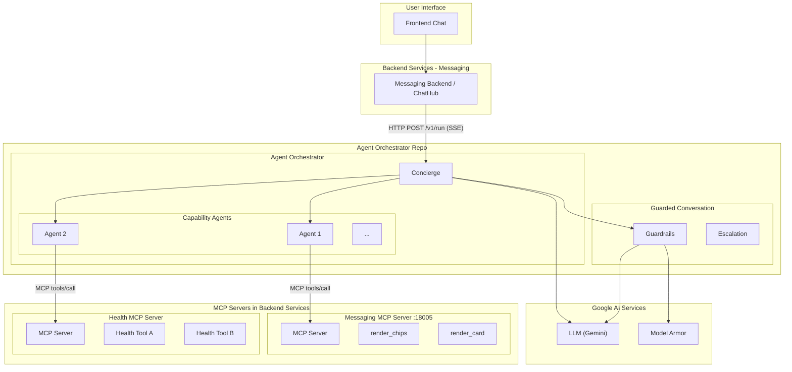

---

## How MCP Tool Discovery Works (Key Finding)

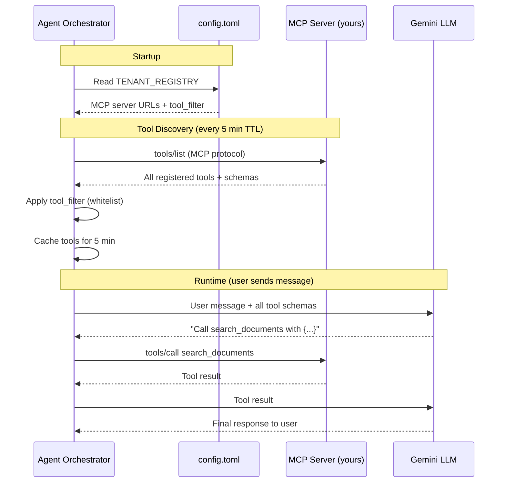

### What This Means

- **MCP servers**: registered in AOR `config.toml` (URL + name)
- **Tools**: auto-discovered via MCP `tools/list` protocol -- no hardcoded tool lists in AOR code
- **tool_filter**: optional whitelist. Empty `[]` = all tools exposed. If set, only listed tools are visible
- **LLM decides**: Gemini sees tool schemas (name, description, parameters) and decides when to call them
- **Cache TTL**: 5 minutes. New tools appear within 5 min of server restart
- **No AOR code changes needed**: just config.toml lines

### AOR Config Change Required (3 lines)

Either add to an agent's `mcp_tools` or to `concierge_mcp_tools`:

```toml
# Option A: New MCP server in connected_care (cleaner)
[[TENANT_REGISTRY.league.concierge_mcp_tools]]
name = "documents_mcp"
url = "http://connected-care:18006/mcp"
tool_filter = []

# Option B: Add tools to existing messaging MCP server (no new server)
# Just update existing tool_filter to include new tool names
```

---

## Primary Plan: Unified Document MCP Tools (Connected Care + Messaging)

### The Story

> "I gave our AI agent the ability to help users find their documents --
> whether they're health documents (statements, bills) or files shared
> in conversations -- all through a single chat experience.
> Metadata stays private by default. Content is only read with explicit
> user consent."

### Privacy-First Design Principle

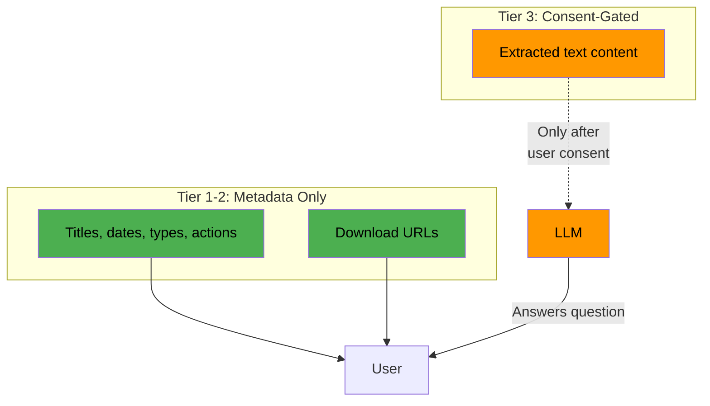

**Default rule: tools return metadata + download links, not raw content.**

- Tier 1-2 tools (search, filters, links): metadata only, no content to the LLM
- Tier 3 tool (`read_document_content`): **exception** -- sends extracted text
  to the LLM, but ONLY after explicit user consent via `render_chips`
- User downloads files directly from the backend via link
- Document titles may contain PII (same as current REST API) --
  Guarded Conversation / Model Armor handles output sanitization

### Two Document Sources

Users have documents in two places. The agent needs to know about both.

| | Connected Care Documents | Messaging Attachments |
|---|---|---|
| **Examples** | Statements, bills, plan docs, uploads | Files shared in chat threads |
| **Storage** | Tenant extension backend | Tenant extension backend |
| **Has search** | Yes (filters, pagination) | No (embedded in thread messages) |
| **Has download** | Yes (`GET /document-content/{id}`) | Yes (`GET /messaging-documents/{id}`) |
| **MCP server** | New (:18006) | Existing (:18005) |

### Architecture: Tools Split Across Two MCP Servers

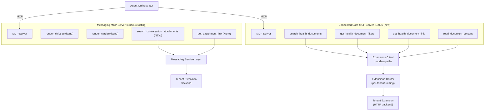

Each tool lives in the MCP server of the service that owns the data.
The LLM sees all tools and picks the right one based on user intent.

### Why Extensions Client, Not Connector (Important)

The document management codebase has two paths:

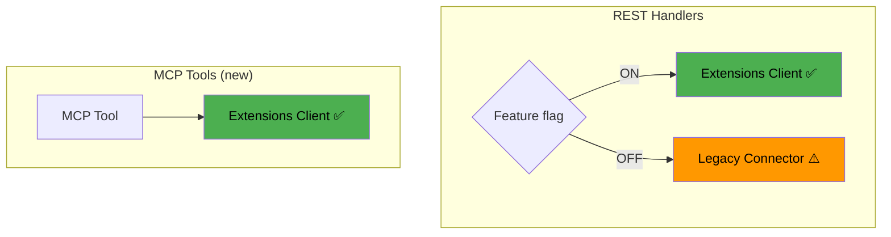

- **Connector** = legacy pattern (tenant-specific, being phased out)
- **Extensions client** = modern pattern (HTTP to tenant extension backends)
- REST handlers check a feature flag to choose between them
- **MCP tools go directly through the extensions client** -- no feature flag
  branching needed since MCP tools are new code with no legacy to support

This makes the MCP tools:
- **Simpler** -- one path, no branching
- **Future-proof** -- aligned with where the team is headed
- **Cleaner** -- no dependency on legacy connectors

For local testing: the extensions framework provides `MockServer` and mock
`ExtensionsCaller` (in `extensions_client/mocks/`). Wire the mock into the
MCP server the same way REST handler tests do.

### Tool Inventory

#### Connected Care MCP Server (:18006) -- NEW server

**Tool 1: `search_health_documents`** (Priority: Core)
- Calls: `extensionsClient.SearchDocuments(ctx, params)`
- Input: filter key (statements, bills, plan_docs, uploaded_by_me), optional
  date range, optional document type
- Output: list of document metadata (id, title, fileType, createdDate, actions)
- Returns: **metadata only, no content**
- Agent UX: *"I found 3 statements from 2025. Would you like to view one?"*

**Tool 2: `get_health_document_filters`** (Priority: Core)
- Calls: `extensionsClient.GetDocumentFilters(ctx, params)`
- Input: none (tenant-scoped via JWT context)
- Output: available filter categories with options (Statements, Bills, etc.)
- Returns: **category labels only**
- Agent UX: lets the agent know what it can search before asking the user

**Tool 3: `get_health_document_link`** (Priority: Core)
- Constructs download URL from document ID and host config
- Input: documentId, documentType
- Output: download URL (e.g. `https://api.league.com/v1/document-content/{id}`)
- Returns: **URL only, not the bytes**
- Agent UX: *"Here's your January 2026 statement"* with a download link

**Tool 4: `get_health_document_configs`** (Priority: Stretch)
- Calls: tenant config service
- Output: max file size, allowed types, max documents
- Agent UX: guides users through upload constraints

#### Messaging MCP Server (:18005) -- ADD to existing

**Tool 5: `search_conversation_attachments`** (Priority: Stretch)
- Wraps: `GetThreads` + `GetMessagesForThread`, extracts documents
- Input: optional threadId, optional limit
- Output: list of attachment metadata (fileName, type, size, threadId, sentAt)
- Returns: **metadata only, no content**
- Agent UX: *"You shared 2 files in your last conversation: report.pdf and photo.jpg"*

**Tool 6: `get_attachment_link`** (Priority: Stretch)
- Wraps: constructs download URL from attachment ID
- Input: attachmentId
- Output: download URL (e.g. `https://api.league.com/v1/messaging-documents/{id}`)
- Returns: **URL only, not the bytes**
- Agent UX: *"Here's the file you shared"* with a download link

### Tool Design Principles (Performance & Resilience)

The current agent tool chain has known issues: chained tool calls are slow, and
a single failure can leave the agent stuck. These principles mitigate both.

**1. Fat tools over thin tools.**
Return everything the LLM needs in one call. Don't force multiple roundtrips.

```
❌ 3 chained calls (slow, fragile):
  search_documents → returns IDs only
  get_document_details → returns metadata
  get_document_link → returns URL

✅ 1 call (fast, self-contained):
  search_health_documents → returns metadata + links + download URLs
```

**2. Structured error messages that guide the LLM.**
When a tool fails, the error message is the LLM's only recovery signal.
Tell it what happened AND what to tell the user.

```
❌ BAD: "failed to search documents"
   → LLM doesn't know what to do, may hallucinate or retry blindly

✅ GOOD: "No documents found matching the query. The member may not have
   any health documents uploaded. Suggest the member check their document
   upload status or try a different filter category."
   → LLM can relay this naturally to the user
```

**3. Minimize chain depth -- design for the common case.**
For 80% of queries ("show my documents", "do I have any statements?"),
the LLM should be able to answer from a single tool call.

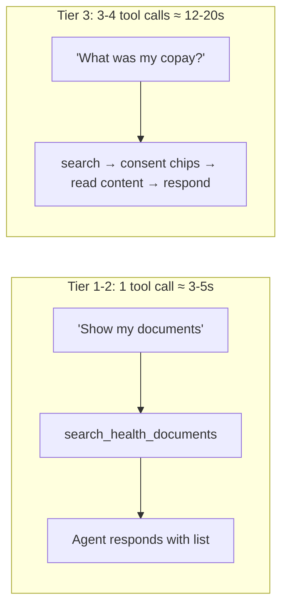

**Latency budget:** Each LLM reasoning step costs 2-5 seconds (Gemini inference).
Tool HTTP calls are fast (~100-200ms). Total latency ≈ N × LLM reasoning time.
The consent interaction in Tier 3 masks perceived wait time since the user
must click before the chain continues.

**4. Tool descriptions are routing logic.**
The LLM decides which tool to call based entirely on the description string.
Vague descriptions cause wrong tool selection. Be specific about WHEN to use
the tool, not just WHAT it does.

### How the LLM Chooses Between Sources

The LLM picks tools based on their descriptions. Good descriptions are critical:

```
search_health_documents:
  "Search the user's health documents including statements, bills,
   plan documents, and user-uploaded files. Use this when the user
   asks about official health plan documents, insurance statements,
   premium bills, or uploaded medical files."

search_conversation_attachments:
  "Search for file attachments shared in the user's messaging
   conversations. Use this when the user asks about files they
   sent or received in a chat or conversation thread."
```

Example routing:

| User says | LLM calls |
|---|---|
| "Find my latest statement" | `search_health_documents` |
| "What bills do I have?" | `search_health_documents` |
| "What file did I send in my last chat?" | `search_conversation_attachments` |
| "Show me all my documents" | Both tools, merges results |

### End-to-End Flow

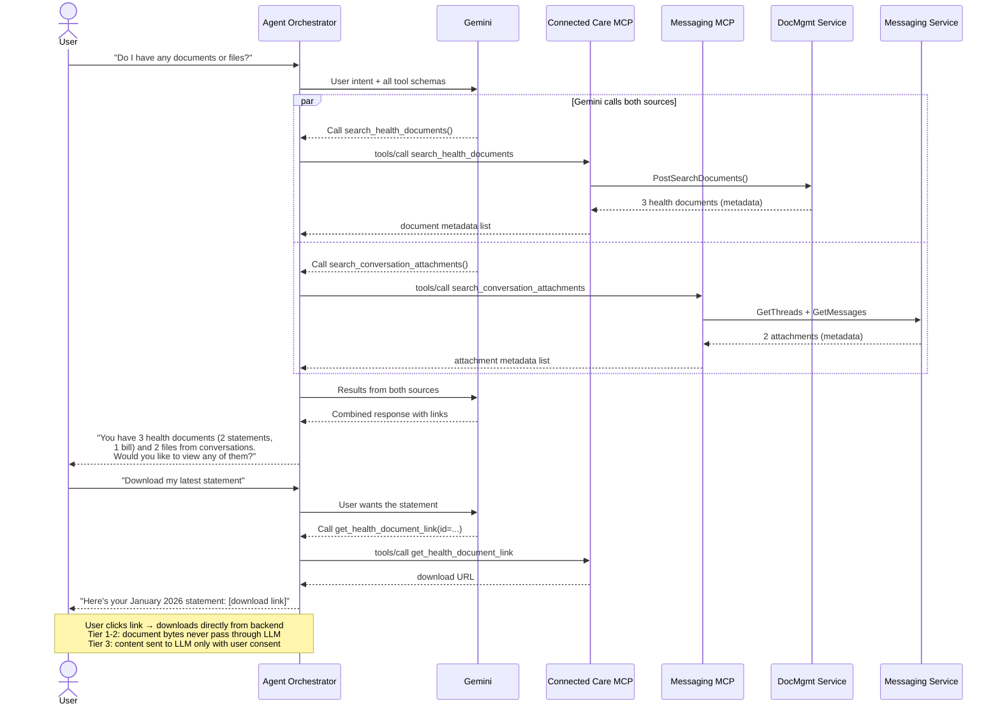

### Implementation Approach

File structure:

```
# Connected Care MCP (new server)
connected_care/
├── mcp/
│   ├── mcp_server.go
│   └── tools/
│       ├── search_health_documents/
│       │   ├── tool.go
│       │   └── models.go
│       ├── get_health_document_filters/
│       │   ├── tool.go
│       │   └── models.go
│       └── get_health_document_link/
│           ├── tool.go
│           └── models.go
├── conf/
│   ├── conf.go                         # Add MCPServer config
│   └── connected_care.go               # Add MCP startup/shutdown
└── resources/
    └── dev_conf/connected_care.toml    # Add [MCPServer] section

# Messaging MCP (add to existing server)
messaging/chathub/mcp/
└── ui_tools/
    ├── render_chips/                    # existing
    ├── render_card/                     # existing
    ├── search_conversation_attachments/ # NEW
    │   ├── tool.go
    │   └── models.go
    └── get_attachment_link/             # NEW
        ├── tool.go
        └── models.go
```

### AOR Config Changes

```toml
# Add connected_care MCP server (new)
[[TENANT_REGISTRY.league.concierge_mcp_tools]]
name = "documents_mcp"
url = "http://host.docker.internal:18006/mcp"
tool_filter = []

# Update messaging MCP tool_filter to include new tools (if filtered)
# Or keep tool_filter = [] to auto-expose all tools
```

### User Context Flow (How Tools Get User Identity)

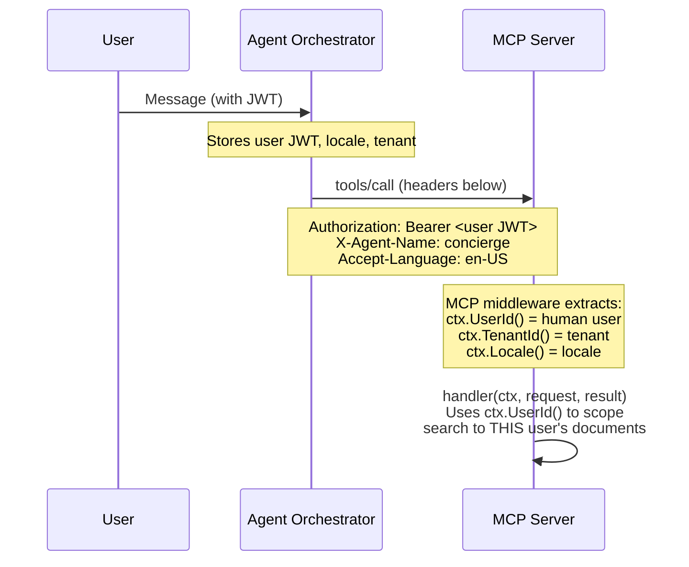

No special auth plumbing needed. AOR forwards the user's JWT, the shared
MCP framework middleware extracts userId and tenantId, and your tool handler
gets a fully populated context.

### Tier 3: Consent-Gated Content Access (The "Wow" Moment)

The killer feature. The agent doesn't just find documents -- it reads them
and answers questions about their contents, with explicit user consent.

**Tool: `read_document_content`** (Priority: Day 2 core)
- Calls: `extensionsClient.GetDocumentContent(ctx, params)` + text extraction
- Input: documentId, documentType
- Output: extracted text content from the document
- Privacy: **consent-gated** -- agent asks user first via chips
- Audit: logs consent event (userId, documentId, timestamp)
- Agent UX: *"Your January copay was $25.00 for your visit on Jan 15."*

**Consent flow using existing render_chips:**

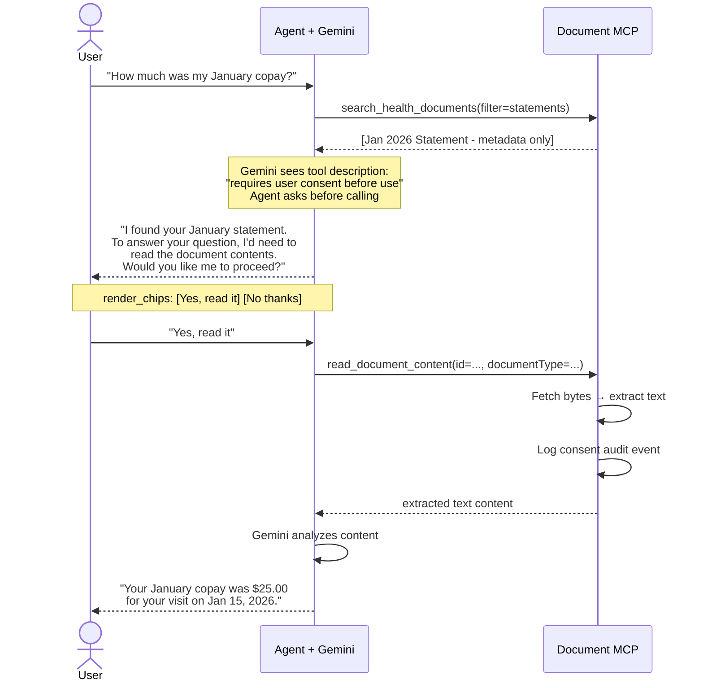

**Why this works for the hackathon:**
- Mock extension returns fake documents -- no real PHI in the demo
- Consent UX uses existing `render_chips` -- no frontend changes
- The LLM handles the consent conversation naturally from the tool description
- Demonstrates responsible AI thinking alongside ambitious product vision

**Multi-tenant by design:** The tools work for ALL tenants. The extensions
client routes to the correct tenant extension backend based on
`ctx.TenantId()` from the JWT. The MCP tools never reference any
specific tenant.

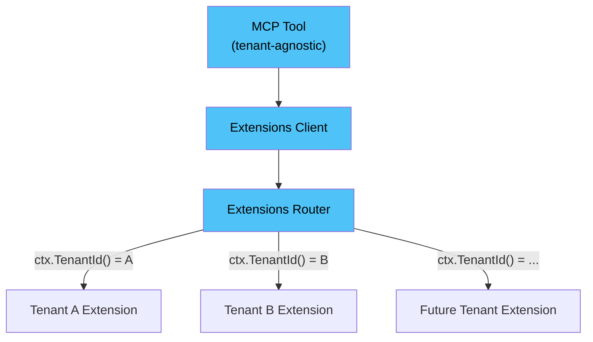

The MCP tool calls `extensionsClient.SearchDocuments(ctx, params)`. The
extensions router reads `ctx.TenantId()` from the JWT, picks the right
tenant extension backend, and returns documents. Adding a new tenant means
configuring a new extension backend -- zero changes to the MCP tools.

This is the same multi-tenant pattern the REST API already uses. The
MCP tools inherit it for free.

**Content extraction varies by tenant.** One tenant may return PDFs,
another might return HTML or images. The `read_document_content` tool
needs a text extraction layer that handles multiple formats. For the
hackathon, the mock extension returns simple text -- no extraction needed.

### Content Storage Strategy (Production Decision)

For `read_document_content`, the tool needs document bytes. Four options:

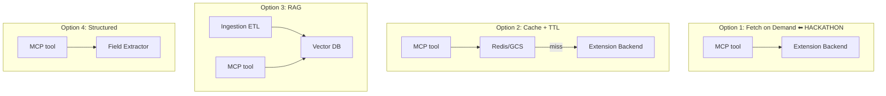

| Option | Storage | PHI Risk | Power | Ownership Change | Multi-tenant |
|---|---|---|---|---|---|
| **1: Fetch on demand** | None | At call time | Medium | None | Works (each extension) |
| **2: Cache with TTL** | Temporary copies | Cached PHI | Medium | Partial | Per-tenant TTL/policy |
| **3: RAG pipeline** | Full text + embeddings | High | Maximum | **Full** | Heavy per-tenant infra |
| **4: Structured fields** | Derived data only | Minimal | Limited | Minimal | Per-tenant extractors |

**Hackathon: Option 1** -- fetch on demand, no storage, works with any extension.

**Production: team decision** -- likely Option 1 first, evolve to Option 2 or 4
based on latency requirements and compliance review. The MCP tool is an
abstraction -- its internal implementation can change per tenant without
affecting the agent interface.

**Production requirements (not for hackathon, but shows awareness):**

| Requirement | Hackathon | Production |
|---|---|---|
| Multi-tenant | Mock extension | All tenant extensions |
| User consent | Chips UX (done) | Chips UX + legal copy |
| PHI to LLM | Mock data only | Requires Google BAA / HIPAA review |
| Audit trail | Log to stdout | Structured audit to compliance system |
| Content extraction | Basic text/mock | PDF → text pipeline per tenant |
| Feature flag | tool_filter in AOR config | AB test + compliance approval |

### Day-by-Day Plan

**Day 1 (March 3) -- Setup & Tier 1 Tools**
- [ ] Set up Claude Code if not already configured
- [ ] Get comfortable with Cursor Agent mode on your own codebase
- [ ] Study the MCP tool pattern in messaging (render_chips, render_card)
- [ ] Scaffold connected_care MCP server (mcp_server.go, config, Wire)
- [ ] Implement `get_health_document_filters` (simplest, good warm-up)
- [ ] Implement `search_health_documents`
- [ ] Implement `get_health_document_link`
- [ ] Validate all with MCP Inspector (`npx @modelcontextprotocol/inspector`)

**Day 2 (March 4) -- Tier 3, Integration & Demo**
- [ ] Implement `read_document_content` (the "wow" tool)
- [ ] Wire up startup/shutdown in connected_care
- [ ] Add MCP config to AOR's config.toml
- [ ] Test full flow with mock extension via AOR chat CLI
- [ ] Practice the consent flow demo: question → consent → answer
- [ ] Stretch: `search_conversation_attachments` in messaging MCP
- [ ] Stretch: `get_attachment_link` in messaging MCP
- [ ] Run full demo flow (see Demo Strategy below)

---

## Demo Strategy

### Demo Setup (What to Run)

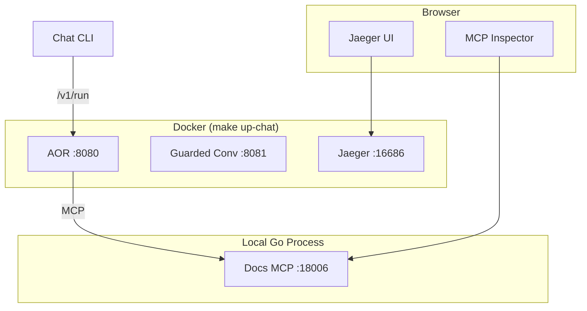

### Startup Checklist

1. Start mock documents extension locally:
   ```bash
   cd /path/to/backend-extensions/connectors/mocks/documents
   go mod vendor
   gcloud alpha functions local deploy test \
     --entry-point=Entrypoint --runtime=go121 \
     --set-env-vars TENANT=league
   ```
   Note the local URL (typically `http://localhost:8080`).

2. Start connected_care locally with:
   - MCP server enabled on port 18006
   - Extensions config pointing to mock: `baseUrl = "http://localhost:8080"`,
     `authType = "none"`, `useTestingApis = true`

3. Start AOR stack: `make up-chat` in the agent-orchestrator repo
   (with `documents_mcp` entry in config.toml)

4. Open MCP Inspector: `npx @modelcontextprotocol/inspector@latest`

5. Open Jaeger: `http://localhost:16686`

### Full Local Demo Stack

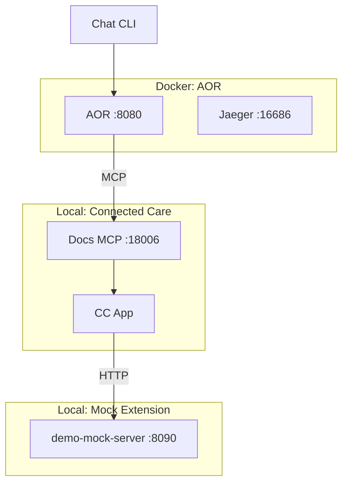

**Mock extension returns:**
- `GetDocumentFiltersResponse1` -- filter categories
- `GetDocumentsListResponse1` -- document list with metadata
- `DocumentContentMock(id)` -- document content bytes (for Tier 3)

**NOTE:** The built-in mock data is likely too generic for a compelling demo.
Use the standalone demo mock server (see `demo-mock-server/` in repo root)
which returns rich, realistic data designed for the demo story.
See "Demo Mock Server" section below.

### Demo Flow (5-minute Townhall demo structure)

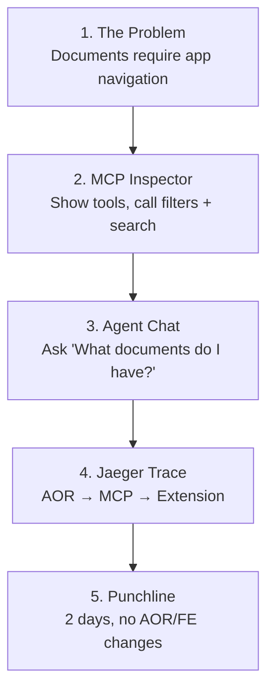

### Detailed Demo Script

**Step 1 -- Context (30 sec)**
> "Users have documents in two places: health documents in Connected Care
> (statements, bills, plan docs) and file attachments in messaging threads.
> Today, finding either requires navigating specific app screens.
> I wanted the AI agent to surface both through chat -- with metadata
> by default, and content reading only when the user explicitly consents."

**Step 2 -- MCP Inspector (1 min)**
- Open browser → connect to `http://localhost:18006/mcp` (Connected Care)
- Click "List Tools" → show `search_health_documents`, `get_health_document_filters`,
  `get_health_document_link`
- Execute `get_health_document_filters` → show filter categories
- Execute `search_health_documents(filter=statements)` → show document metadata
- Point out: *"Notice: titles, dates, types -- no document content. Just metadata."*
- If stretch tools built: connect to `http://localhost:18005/mcp` (Messaging),
  show `search_conversation_attachments` alongside existing render_chips/render_card

**Step 3 -- Agent Chat: Navigation (1 min)**
- Switch to terminal with AOR chat CLI
- Type: *"What documents do I have?"*
- Agent calls `search_health_documents`, responds with document list
- Type: *"Can I get my latest statement?"*
- Agent calls `get_health_document_link`, responds with download URL
- Point out: *"So far the agent sees metadata only -- titles, dates, links.
  No document content touches the LLM. But watch this..."*

**Step 4 -- Agent Chat: The Consent Flow (1.5 min) -- THE WOW MOMENT**
- Type: *"How much was my copay on that statement?"*
- Agent realizes it needs to read the content
- Agent responds: *"To answer that, I'd need to read the document contents.
  Would you like me to proceed?"* [Yes, read it] [No thanks]
- Click *"Yes, read it"*
- Agent calls `read_document_content`, reads the mock document
- Agent responds: *"Your copay was $25.00 for your visit on January 15, 2026."*
- Pause for effect. Then explain:
  > "The agent asked for consent before reading the document. That consent
  > is logged for audit. In production, this would require compliance approval
  > and Google BAA review. Today it runs on mock data. But the architecture
  > is ready."

**Step 5 -- Jaeger Trace (30 sec)**
- Show the full span: AOR → MCP tools/call → extensions client → extension
- Point out the `read_document_content` call with consent audit

**Step 6 -- Wrap Up (1 min)**
> "Two tiers of document intelligence. Tier 1: safe metadata and links,
> deployable today. Tier 3: consent-gated content reading, ready to
> enable when compliance approves.
> Built in two days using Cursor Agent mode.
> No AOR code changes. No frontend changes.
> Any team can follow this pattern for their domain."

### Fallback Demo (if AOR has issues)

If Docker/Gemini/auth problems prevent the full AOR demo:
- **MCP Inspector alone** still shows the tools working end-to-end
- **Postman** can call both the REST API and MCP JSON-RPC side by side:

```
# REST (how the mobile app does it today)
POST http://localhost:5600/v1/search-documents

# MCP (how the AI agent does it now)
POST http://localhost:18006/mcp
{"jsonrpc":"2.0","id":1,"method":"tools/call",
 "params":{"name":"search_documents","arguments":{"filter":"statements"}}}
```

This shows: "same data, new interface for the AI agent."

---

## Why This Matters (How to Sell It)

### The Product Pitch

**The problem today:**
Users who want to find a document must: open the app → navigate to documents →
pick a filter category → scroll through results → tap to view. That's 4-5 steps
of UI navigation. For members who are less tech-savvy, elderly, or in a hurry,
this is friction that leads to support calls.

**The shift:**
The user types *"show me my latest statement"* in chat. Done. One step.

**Why this is bigger than documents:**

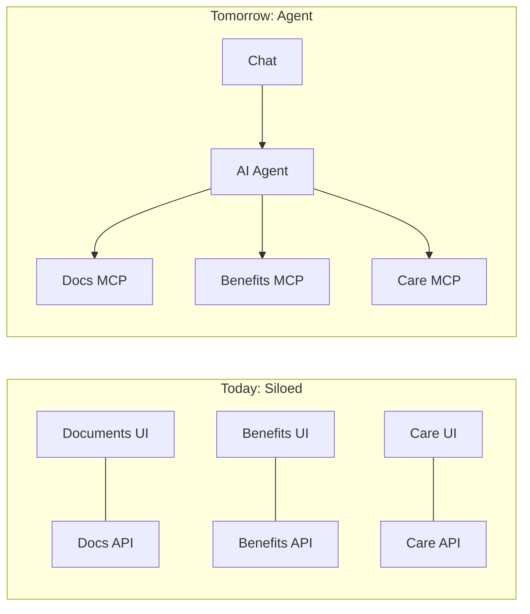

Today, every feature has its own UI. Users must know WHERE to go to do
WHAT. The AI agent flips this: the user states their intent, and the agent
figures out which services to call. Documents is one example, but the
pattern applies to every domain -- benefits, health, care team, claims.

**Key product talking points:**

1. **Reduced friction** -- Natural language replaces UI navigation.
   "Find my January statement" vs tap-tap-scroll-tap.

2. **Cross-feature discovery** -- The agent can connect domains. A user
   asking about an upcoming appointment could also be shown relevant
   documents ("I see you have a pre-visit form to fill out"). The agent
   sees ALL available tools and can combine them.

3. **Accessibility** -- Users who struggle with complex app navigation
   (elderly members, low digital literacy) can just describe what they need.

4. **Reduced support calls** -- "Where do I find my statement?" is a top
   support question. If the agent can answer that directly, it deflects
   calls and saves money.

5. **Incremental enhancement** -- Each team adds MCP tools for their domain.
   The agent gets smarter with each addition. No coordination needed between
   teams -- MCP is the contract.

### The Technical Pitch

**Why MCP matters architecturally:**

1. **MCP is the emerging standard** -- Like REST was for web APIs in the 2010s,
   MCP (Model Context Protocol) is becoming the standard for AI tool integration.
   Building MCP tools now means we're adopting the right abstraction early.

2. **Zero coupling between services** -- The agent discovers tools dynamically
   via `tools/list`. Connected Care doesn't know about ChatHub. ChatHub doesn't
   know about Connected Care. AOR just connects them. Teams work independently.

3. **The LLM handles routing** -- No hardcoded if/else logic to decide when to
   search documents vs check benefits. Gemini reads tool descriptions and
   decides based on user intent. Adding a new tool doesn't require updating
   routing logic anywhere.

4. **Clean separation: data tools vs UI tools** -- Document MCP tools provide
   DATA (search results, filters). Messaging MCP tools handle PRESENTATION
   (render_card, render_chips). The agent composes them. This is a natural
   backend/frontend separation at the AI layer.

5. **No AOR code changes, no FE changes, no ChatHub code changes** -- This
   is the power of the architecture. Adding a new capability to the AI agent
   requires:
   - Backend team: build MCP tools (Go, same patterns as REST handlers)
   - AOR team: 3 lines of config
   - Frontend team: nothing (existing UI widgets)
   - ChatHub team: nothing (already connected to AOR; new tools are
     available to all ChatHub users the moment they deploy)

6. **Extensibility template** -- This creates a replicable pattern. Any team
   that owns a backend service can follow the same steps to expose their
   domain to the AI agent. The connected_care MCP server becomes the
   reference implementation alongside the existing messaging, health, and
   benefits MCP servers.

**Technical talking points for engineers:**

- "ChatHub already talks to AOR. My MCP tools are registered in AOR. The
  moment these deploy, every ChatHub user gets document intelligence --
  zero ChatHub code changes, zero frontend changes."
- "MCP tools are just REST handlers with a different transport. If you can
  write a REST endpoint, you can write an MCP tool."
- "The tool_filter in AOR config acts like feature flags -- you can
  register tools but only expose them when ready."
- "The mock extension means you can develop and test without tenant
  dependencies. Same mock-first approach we use for REST."
- "The 5-minute cache TTL means you can iterate fast locally -- add a tool,
  restart the MCP server, and AOR picks it up automatically."

**Production evolution: standalone tools → capability agent**

The hackathon builds standalone MCP tools -- the LLM decides when and how
to call them. This is fast to build (no AOR code) and flexible. But for
production, the consent flow should move into a deterministic capability
agent in AOR:

- **Hackathon (standalone tools):** LLM reads "requires consent" in the
  tool description and usually asks. Good enough for demo, not for compliance.
- **Production (capability agent):** A Python agent in AOR with a hardcoded
  workflow: search → ask consent → read content. Guarantees consent is
  never skipped. The MCP tools remain the same -- only the orchestration
  changes.

This is a deliberate two-step approach: prove the tools work first, then
harden the orchestration. The MCP tool interface is the stable contract
between both approaches.

### The Strategic Pitch (for leadership)

This connects directly to the hackathon's stated vision:

> "Every Leaguer operating as a team of one, powered by agents."
> -- Dan Galperin

The AI agent can only be as powerful as the tools it has access to.
Right now it can render cards and chips. With document management tools,
it can find and retrieve health documents. With benefits tools, it can
answer coverage questions. Each MCP tool is a new capability.

**The flywheel:**
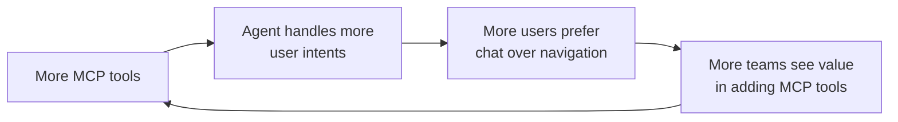

This hackathon project is a concrete step toward that flywheel. It
demonstrates the pattern, proves it works end-to-end, and creates a
template for every other team to follow.

**What this pattern looks like for other teams:**

| Team | MCP Tool | User asks | Agent does |
|---|---|---|---|
| **Benefits** | `check_coverage` | "Does my plan cover physiotherapy?" | Calls benefits API, returns coverage details |
| **Care Team** | `find_provider` | "Who is my primary care doctor?" | Calls care navigation, returns provider info |
| **Claims** | `get_claim_status` | "What happened with my last claim?" | Calls claims API, returns status and amounts |
| **Pharmacy** | `check_prescription` | "When is my refill due?" | Calls pharmacy API, returns prescription schedule |
| **Appointments** | `book_appointment` | "Schedule a checkup next week" | Calls scheduling API, creates appointment |

Each team builds 1-3 MCP tools wrapping their existing APIs. No
coordination between teams. No AOR code. The agent gets smarter with
each addition. Documents is the first example -- the pattern is the
real deliverable.

**Document tools as shared infrastructure:**

Once the document MCP tools exist, any agent in AOR can call them --
not just the concierge. Other teams don't build their own document
tools. They compose yours into their flows.

| Another team's agent | Uses your document tools to... | Example |
|---|---|---|
| **Benefits** | Surface the plan document after explaining coverage | "Your plan covers 80% of physiotherapy. Want to see your Summary of Benefits?" |
| **Claims** | Link to the statement matching a processed claim | "Your Jan 15 claim was processed. Details are in your January statement." |
| **Care Navigation** | Surface pre-visit forms after booking | "Appointment confirmed. You have a pre-visit form -- want me to find it?" |
| **Onboarding** | Guide new members to plan docs on day one | "Welcome! You have 3 plan documents. Want to review your benefits summary?" |

This turns documents from a standalone feature into a composable
capability that makes every other agent smarter.

---

## Other Ideas (Parking Lot)

### ChatHub Enhancements

| Idea | Effort | Impact | FE Blocked? | Notes |
|------|--------|--------|-------------|-------|
| **render_list** | 2-3h | Medium | YES | New widget, FE needs a list component |
| **render_action_buttons** | 2-3h | Medium | YES | New widget, FE needs button group component |
| **SSE streaming to WebSocket** | 4-6h | High | Partial | FE needs incremental message append |
| **Session message improvements** | 2-3h | Medium | No | Return user messages, fix after_message_id, pagination |
| **Circuit breaker / retry** | 2-3h | Medium | No | Resilience for AOR calls. Solid engineering but not demo-friendly |

### Alternative Document Management Scopes

If the proxy concern feels too limiting, alternative angles:

- **Document upload assistant**: agent guides user through upload (validates
  file type, size, recipient) before they upload via the app
- **Document notification tool**: agent proactively tells user about new
  documents (when a new statement is available)
- **Document FAQ tool**: agent answers questions about document types, where
  to find things, what actions are available -- pure metadata, no content access

---

## Key References

### Messaging (MCP pattern to follow)
- MCP server wrapper: `messaging/chathub/mcp/mcp_server.go`
- Tool registration: `RegisterUITools()` calls `mcp.RegisterTool()`
- Tool builder: `components/mcp/mcp_server.go` -> `RegisterTool()`
- render_chips example: `messaging/chathub/mcp/ui_tools/render_chips/tool.go`
- render_card example: `messaging/chathub/mcp/ui_tools/render_card/tool.go`
- MCP config: `components/config/services.go` -> `MCPServerConfig`
- Framework: `league.dev/backend/components/mcp`

### Connected Care (extensions client to use)
- Extensions client: `connected_care/extensions_client/client_impl.go`
- Extensions routing: `connected_care/document_management/server_impl.go` (reference for how REST handlers use it)
- Extension flag check: `useDocumentExtensions()` in `server_impl.go`
- Types: `connected_care/document_management/types_gen.go`
- Mock extensions caller: `connected_care/extensions_client/mocks/extensions_caller_gen.go`

### Backend Extensions (mock for demo)
- Mock documents extension: `backend-extensions/connectors/mocks/documents/`
- Mock data source: `backend-modules/backend-extensions/mocks/documents`
- Documents template/spec: `backend-modules/backend-extensions/templates/documents`
- Run locally: `gcloud alpha functions local deploy test --entry-point=Entrypoint --runtime=go121`
- Standalone demo mock: `demo-mock-server/` in this repo (preferred for hackathon)

### Agent Orchestrator (config only)
- Config file: `agent-orchestrator/apps/agent-orchestrator/src/config.toml`
- Tenant registry: `TENANT_REGISTRY.<tenant>.concierge_mcp_tools` or agent `mcp_tools`
- Tool discovery: auto via MCP `tools/list`, filtered by `tool_filter`
- Cache TTL: 5 min default
