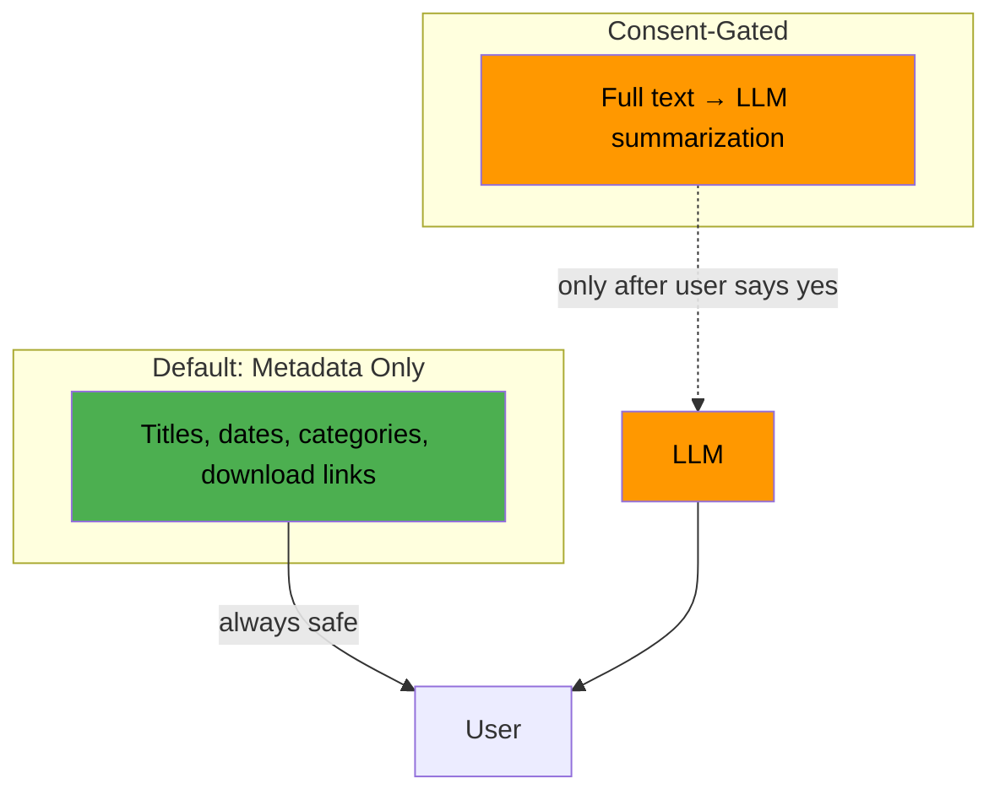
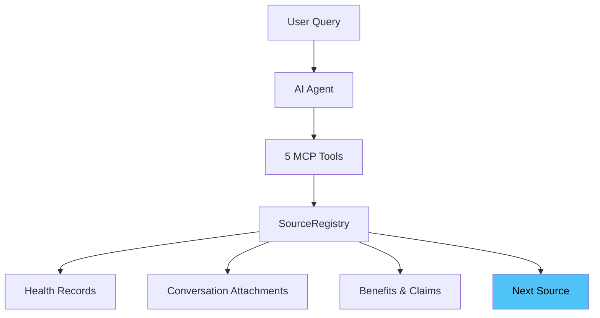

# Document Concierge — Hackathon Presentation

## Slide 1: The Problem

Users have documents scattered across the platform — health records, chat attachments, benefits statements. Finding them means navigating to the right screen, picking the right filter, scrolling through results. 4-5 taps to find one document.

What if they could just ask?

> "What documents do I have?"

> **Speaker notes:** Without a unified approach, every new document type would need its own set of tools — health gets 3-4 tools, messaging gets 3-4 tools, benefits gets 3-4 tools. That's tool explosion. We solved it so that 5 tools handle everything, forever.

---

## Slide 2: One Source — Health Documents

We start with health documents. The AI agent has 5 MCP tools that let it search, browse, filter, read, and upload documents on behalf of the user.

**Demo: Health Documents only**

- "What documents do I have?" → agent finds 10 health records, shows cards
- "Show me my monthly statements" → agent filters by category
- "Read my January statement and summarize it" → agent asks for consent, then summarizes

The consent flow is the key moment: the agent **never reads document content without asking first**. Metadata is always safe. Content requires explicit permission.

> **Speaker notes:** The tools also have built-in RESPOND instructions — every tool output tells the LLM exactly how to format the answer (cards, chips, text). This is why the UX is consistent across all sources without any frontend changes.

---

## Slide 3: What Happens When We Add a Second Source?

Now toggle on **Conversation Attachments** in the Sources panel.

**Demo: Health + Messaging**

- Same question: "What documents do I have?"
- Agent now discovers **2 sources**, shows counts for each, lets the user pick
- "What files were shared in my conversations?" → routes to messaging source
- Welcome screen suggestions update to include messaging prompts

No code was changed. No tools were added. The system adapted.

> **Speaker notes:** Point out the welcome screen — the suggested prompts changed when you toggled the source. That's dynamic too. Also, the tool descriptions that the LLM sees are generated from the registry at startup. When a new source is registered, the LLM automatically knows about it — no prompt engineering needed.

---

## Slide 4: And a Third?

Toggle on **Benefits & Claims**.

**Demo: Health + Messaging + Benefits**

- "What documents do I have?" → 3 sources with counts
- "What benefits documents do I have?" → routes to benefits, shows EOBs and claim summaries
- Filters work for benefits too — "Show me my EOBs"

Again — no code changes. The same 5 tools serve all 3 sources.

---

## Slide 5: Why This Works

Behind the 5 tools is a `DocumentSource` interface and a `SourceRegistry`. Every document backend implements the same interface. The tools don't know or care which source they're talking to.

Adding a new source: implement one Go interface, register it. The tools automatically include it in descriptions, discovery, search, read, and upload.

> **Speaker notes:** We validated this claim by adding the Benefits source ourselves. Zero tool changes, zero AOR changes. There's also a step-by-step integration guide in the design doc — any team can follow it to add their document backend. The pattern extends beyond documents to any domain.

---

## Slide 6: What Ships to Production

This isn't throwaway hackathon code. The tools, the interface, the registry, and the tests are all production code.

| What | Ships? |
|------|--------|
| 5 MCP tools | Yes |
| `DocumentSource` interface | Yes |
| `SourceRegistry` with runtime toggle | Yes |
| `HealthDocumentsSource` (extensions API) | Yes |
| `MessagingAttachmentsSource` (interface-based) | Yes |
| 44 unit tests | Yes |
| Observability (framework-provided) | Yes |
| Stub sources + demo UI | No — demo only |

For the hackathon we stubbed the data sources so the demo runs without the full platform. In production, those stubs swap for real extensions API calls. Everything else is the same code.

> **Speaker notes:** On observability — every tool call is automatically instrumented with Prometheus metrics: execution duration, SLI latency, concurrent executions, and external error attribution. Zero custom metrics code in any of the tools. The framework handles it all. Also, we have an automated test harness (`test-all-prompts.sh`) that runs all welcome screen prompts end-to-end through AOR and validates the responses. That gives us confidence for ongoing development.

Remaining production wiring: auth middleware, messaging adapter, real benefits source, per-tenant source configuration, consent audit logging.

---

## Slide 7: The Bigger Picture

The Document Concierge is a composable capability. Any agent in AOR can call these tools — not just the concierge.

| Agent | Uses document tools to... |
|-------|--------------------------|
| Benefits | "Your plan covers 80% of physiotherapy. Want to see your Summary of Benefits?" |
| Claims | "Your Jan 15 claim was processed. Details are in your January statement." |
| Care Navigation | "Appointment confirmed. You have a pre-visit form — want me to find it?" |

Every source a team adds makes every agent smarter. The pattern extends beyond documents to any domain.
