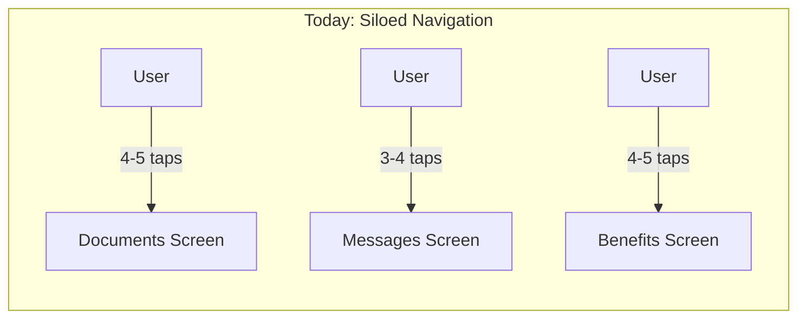
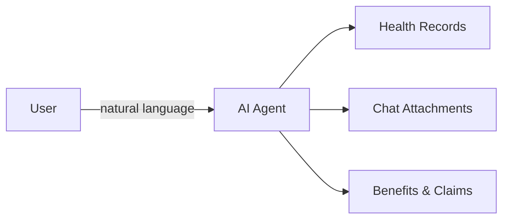
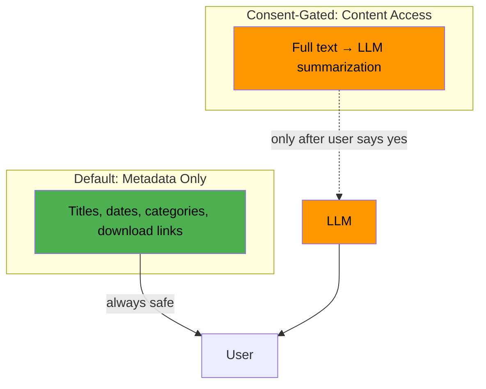
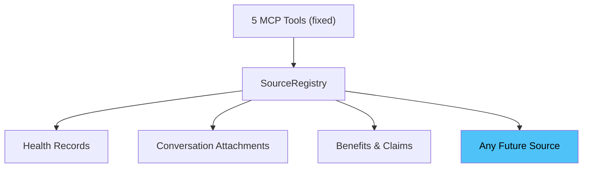

# Document Concierge — Hackathon Presentation

## Slide 1: The Problem

Users have documents scattered across multiple places — health records, chat attachments, benefits statements. Today, finding any of them requires navigating to the right screen, picking the right filter, scrolling through results.

Each source lives behind its own UI. The user has to know **where** to go to find **what**.

---

## Slide 2: The Shift

What if the user could just ask?

> "What documents do I have?"
> "Show me my latest statement."
> "How much was my copay?"

One chat. One interface. The agent figures out the rest.

---

## Slide 3: What We Built — Document Concierge

5 MCP tools that give the AI agent document intelligence across **any** document source.

| Tool | What It Does |
|------|-------------|
| `search_documents` | Browse and search across all sources |
| `list_document_sources` | Discover available sources and counts |
| `get_document_filters` | Narrow results by category |
| `read_document` | Consent-gated summarization |
| `upload_document` | Upload with constraint validation |

The tools are **source-agnostic** — they work the same whether the document is a health statement, a chat attachment, or a benefits EOB.

---

## Slide 4: Privacy by Design

Documents are sensitive. The concierge respects that.

The agent asks for explicit consent before reading document content. This isn't optional — it's built into the tool description. The LLM **must** ask before calling `read_document`.

---

## Slide 5: How It Scales — Zero Tool Changes

The key architecture decision: a `DocumentSource` interface and a `SourceRegistry`.

Adding a new document source:
1. Implement one Go interface
2. Register it
3. Done — all 5 tools automatically include it

No new tools. No AOR changes. No frontend changes. We proved this by adding Benefits & Claims as a third source with **zero** changes to any existing tool.

---

## Slide 6: Hackathon Setup — Production Value Without Production Dependencies

We needed a self-contained demo that doesn't require the full platform stack. But we didn't want throwaway code.

| Layer | Hackathon | Production |
|-------|-----------|------------|
| **Tools** (5 MCP tools) | Same code | Same code |
| **Interface** (`DocumentSource`) | Same code | Same code |
| **Registry** (`SourceRegistry`) | Same code | Same code |
| **Sources** | Stub data (inline mocks) | Real extensions API |
| **Auth** | `WithNoAuth()` | Real auth middleware |
| **Demo UI** | Chat UI + source toggles | Not shipped |

The tools, the interface, the registry, the tests — all production code. Only the data sources swap out. The stubs let us demo without external services, but the architecture is the same one that runs in production.

**44 unit tests** cover the production code. Observability is handled automatically by the MCP framework — every tool call gets Prometheus metrics for free.

---

## Slide 7: Live Demo

### Act 1 — Discovery (Health Documents only)

> "What documents do I have?"

Agent discovers sources, shows document counts, offers interactive chips.

### Act 2 — Targeted Search

> "What health documents do I have?"

Agent searches the specific source, renders document cards with View/Download buttons.

### Act 3 — The Consent Flow

> "Read my January statement and summarize it."

Agent asks for consent → user approves → agent reads and summarizes.

### Act 4 — Scaling Live

Toggle on **Conversation Attachments** in the Sources panel. Ask the same broad question — the system now shows 2 sources. Toggle on **Benefits & Claims** — 3 sources. Zero code changes. The welcome screen suggestions update dynamically.

### Act 5 — Benefits-Specific

> "What benefits documents do I have?"

Agent routes to the benefits source, shows EOBs, claim summaries, coverage letters. This source didn't exist 24 hours ago.

---

## Slide 8: What's Next

The tools are production-ready. Remaining work is infrastructure wiring:

- Wire real auth (replace `WithNoAuth()`)
- Build messaging adapter for production
- Build real benefits source backed by extensions API
- Per-tenant source configuration
- Consent audit logging

The Document Concierge is a composable capability — any agent in AOR can call these tools. Benefits agents can surface plan documents. Claims agents can link to statements. Care navigation can find pre-visit forms. The pattern extends beyond documents to any domain.
