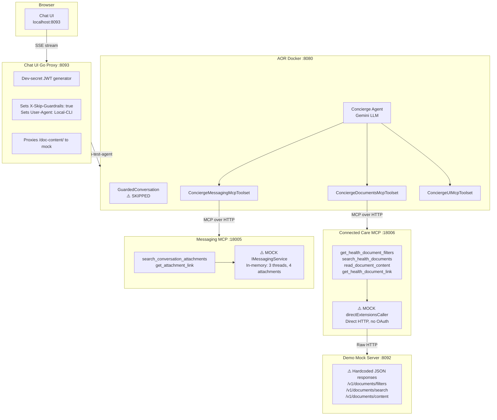
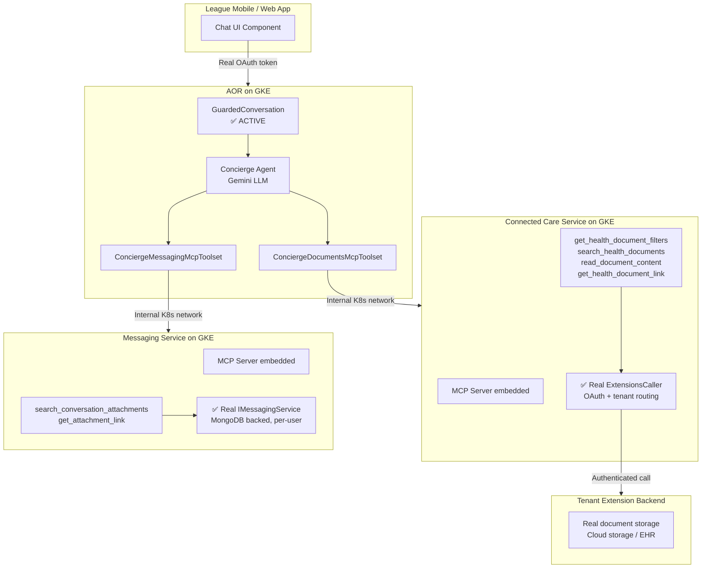
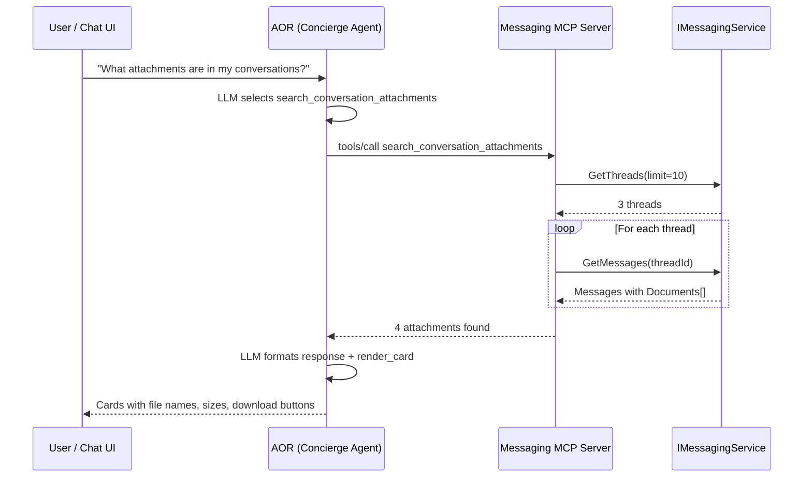
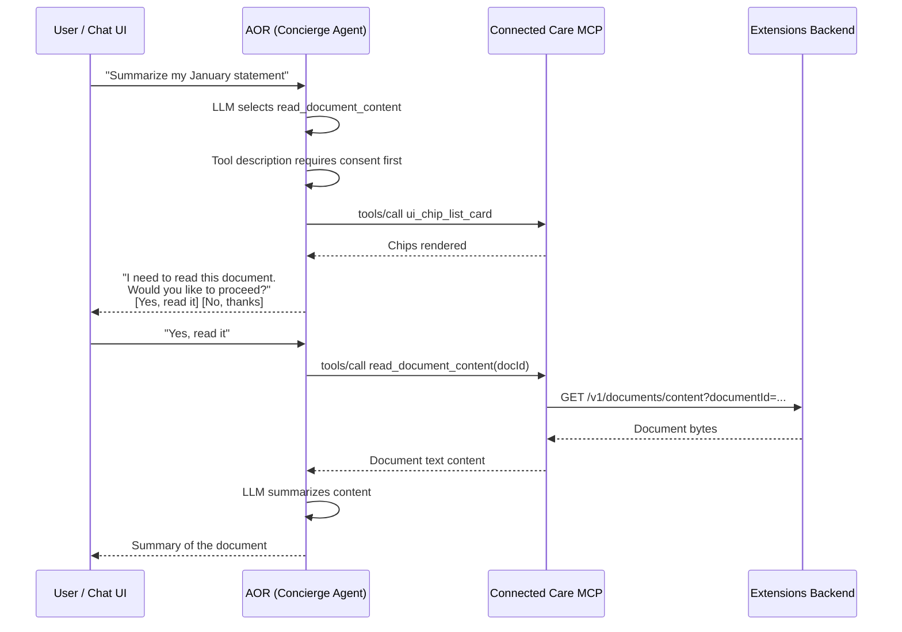
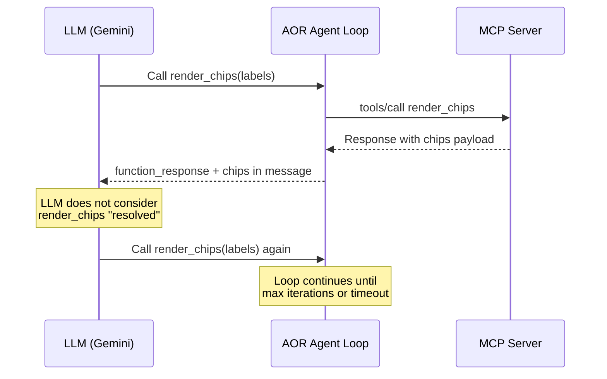

# Production Readiness: Document & Messaging MCP Tools

This document explains the hackathon demo architecture, what is mocked vs. real,
and what is required to ship these tools to production.

---

## Architecture: Demo vs. Production

### Demo (Current State)



### Production (Target State)



### Request Flow: Search Conversation Attachments



### Request Flow: Consent-Gated Document Read



---

## What Is Mocked (and Why)

| Component | Demo | Production | Why Mocked |
|-----------|------|------------|------------|
| **ExtensionsCaller** | `directExtensionsCaller` — direct HTTP to mock server, no auth | Real caller with OAuth, Redis token cache, tenant routing | Avoids needing GCP credentials, extension infra, and tenant config |
| **Mock Extension Server** | Go binary returning hardcoded JSON | Real tenant backend (cloud storage, EHR systems) | No access to real patient documents or tenant backends |
| **IMessagingService** | In-memory struct with 3 threads, 4 attachments | Real service backed by MongoDB with per-user data | Avoids needing the full messaging stack (MongoDB, participants, auth) |
| **JWT / Auth** | `dev-secret` HMAC token, hardcoded `demo-user` | Real OAuth/OIDC tokens from identity provider | No access to identity provider locally |
| **GuardedConversation** | Skipped via `X-Skip-Guardrails` + `Local-CLI` UA | Active — safety/escalation service validates all messages | Escalation service not available locally |
| **MCP Auth** | `WithNoAuth()` on all tools | Should use `WithAuth()` + token forwarding from AOR | No real user context in demo |
| **API Hostname** | Hardcoded `api.league.com` / `localhost:5400` | From service config / environment | No real API gateway locally |

---

## Production Checklist

### 1. Authentication & Authorization

- [ ] **Remove `WithNoAuth()`** from all new tools (`search_conversation_attachments`, `get_attachment_link`)
- [ ] **Replace with `WithAuth()`** to require and validate the MCP request's auth context
- [ ] **Ensure user-scoped data access** — `IMessagingService.GetThreads()` must only return threads belonging to the authenticated user (already the case in production since the service extracts user ID from the request context)
- [ ] **Verify AOR forwards auth tokens** to MCP servers correctly (currently handled by `MCP_AUTH_CREDENTIAL` / `MCP_AUTH_SCHEME` in the toolset)

### 2. Connected Care: Remove Mock Bypass

- [ ] **Remove `local_mcp_server` binary** — or keep it for dev/test only (already flagged with `// HACKATHON`)
- [ ] **Remove `directExtensionsCaller`** — production uses the real `ExtensionsCaller` via Wire injection
- [ ] **Remove demo-mock-server** — no longer needed when real extension backends are available
- [ ] **Verify `ExtensionsCaller` OAuth flow** works with the MCP server's request context
- [ ] **Remove hardcoded `APIHostname`** in `messaging.go` — use proper config (e.g., from `connected_care.toml`)

### 3. Messaging: Wire Into Real Service

- [ ] **Remove `local_mcp_server` binary** for messaging (already flagged)
- [ ] The MCP server is **already wired** into the real messaging service via `conf/messaging.go` and Wire — it receives the real `IMessagingService` implementation
- [ ] **Verify `GetThreads` / `GetMessages` pagination** — demo uses defaults, production may need cursor-based pagination for large thread lists
- [ ] **Add `APIHostname` to messaging config** — currently hardcoded as `"api.league.com"` in `conf/messaging.go`

### 4. AOR Configuration

- [ ] **Move MCP tool entries from `config.toml` to tenant registry** — currently hardcoded with `host.docker.internal` URLs
- [ ] **Update URLs** to use internal Kubernetes service names (e.g., `http://connected-care:18006/mcp`)
- [ ] **Remove `ConciergeMessagingMcpToolset`** file if messaging tools ship under the existing `ConciergeUIMcpToolset` (since they share the same MCP server in production)
- [ ] **Remove `X-Skip-Guardrails` bypass** — let GuardedConversation run normally

### 5. Privacy & Consent

- [ ] **Review `read_document_content` consent flow** — the tool description instructs the LLM to ask for consent via chips before reading document content. Validate this is sufficient for compliance or add server-side enforcement.
- [ ] **Audit document content access logging** — ensure all `read_document_content` calls are logged with user ID, document ID, and consent status for HIPAA audit trail
- [ ] **Evaluate data retention** — confirm that document content passed through the LLM is not stored beyond the session

### 6. Observability

- [ ] **Verify OpenTelemetry tracing** propagates from AOR → MCP server → extension backend (already instrumented in the MCP framework)
- [ ] **Add metrics** for tool call latency, error rates, and attachment counts
- [ ] **Set up alerts** for MCP server health and tool execution failures

### 7. Known Issue: UI Tool Calling Loop

During demo testing, the LLM occasionally enters a loop calling `render_card` and
`render_chips` repeatedly. This is an **AOR agent-loop issue**, not a client or MCP
tool issue.



**Root cause:** The LLM sometimes doesn't treat the `render_chips` / `render_card`
function response as a terminal action, and re-invokes the tool in the next agent
loop iteration.

**Demo workaround:** The chat UI detects when cards or chips arrive and visually
marks the corresponding tool as "Done" to prevent the UI from showing duplicates.
This is cosmetic — the loop still happens server-side.

**Production fix needed (AOR level):**
- [ ] Investigate whether AOR's agent loop should treat `render_card` / `render_chips`
  as terminal tools that end the current turn (similar to how a final text response
  ends the turn)
- [ ] Alternatively, add a `max_consecutive_tool_calls` guard in AOR to break out
  of loops after N identical tool calls
- [ ] Consider whether the tool response schema needs adjustment so the LLM
  reliably recognizes completion

**Impact on Chathub:** This same loop would reproduce in the production Chathub UI
since the behavior originates in the AOR agent loop, not the client. The fix must
be applied at the AOR or tool-description level before production rollout.

### 8. Code Cleanup

All hackathon-specific code is tagged with `// HACKATHON` comments. To find every instance:

```bash
grep -rn "HACKATHON" src/el/connected_care/ src/el/messaging/ src/el/apps/
```

Key items to address:
- [ ] Remove or gate `// HACKATHON: replace with proper auth` markers
- [ ] Remove `// HACKATHON: use proper hostname config` in `messaging.go`
- [ ] Remove `local_mcp_server` binaries (or move to a `tools/` or `cmd/` directory for dev use)
- [ ] Run `wire` to regenerate `wire_gen.go` properly (currently hand-edited)

---

## Files Changed (services repo)

### New Files (Hackathon Only — Remove Before Production)
```
apps/connected_care/local_mcp_server/main.go    ← demo binary
apps/messaging/local_mcp_server/main.go          ← demo binary
```

### New Files (Production Code)
```
connected_care/mcp/mcp_server.go                 ← CC MCP server
connected_care/mcp/tools/get_health_document_filters/
connected_care/mcp/tools/search_health_documents/
connected_care/mcp/tools/get_health_document_link/
connected_care/mcp/tools/read_document_content/
messaging/chathub/mcp/doc_tools/search_conversation_attachments/
messaging/chathub/mcp/doc_tools/get_attachment_link/
```

### Modified Files (Need HACKATHON Markers Removed)
```
messaging/chathub/mcp/mcp_server.go              ← added IMessagingService + doc tools
messaging/conf/messaging.go                       ← hardcoded APIHostname
messaging/conf/wire_gen.go                        ← hand-edited (re-run wire)
```
